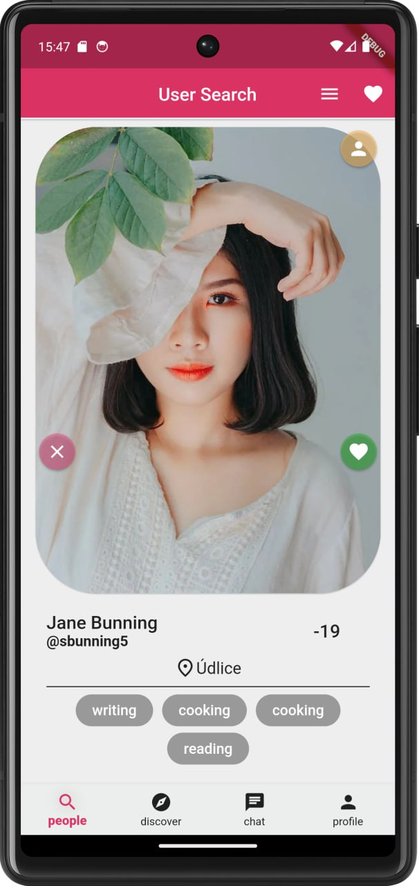
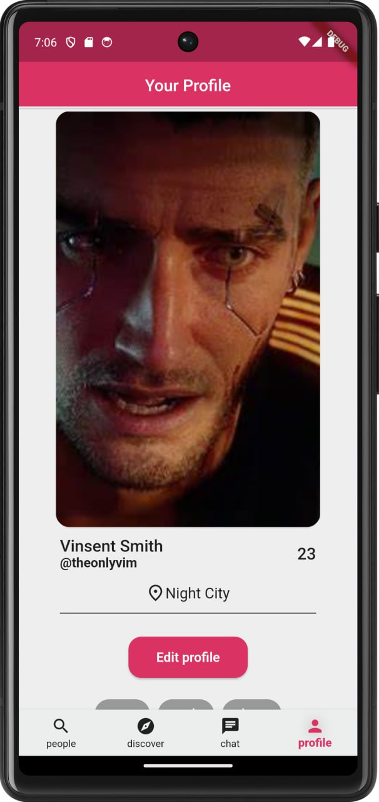
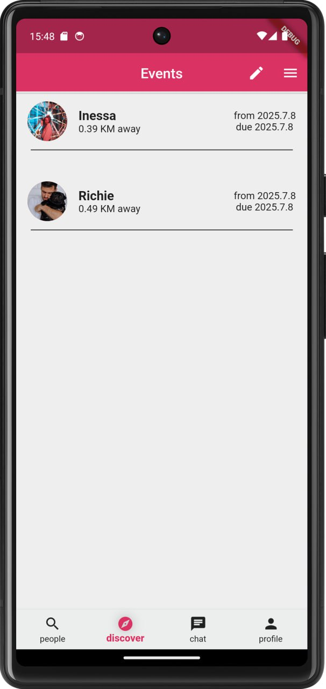
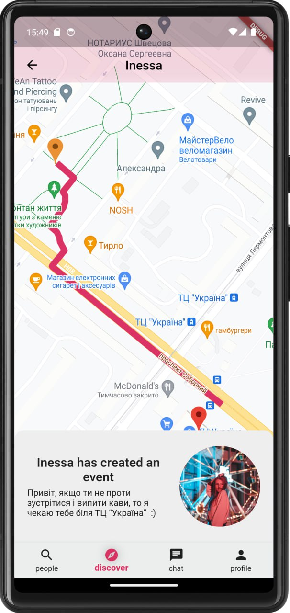

# Amica

_Amica is an App that suppose to connect people with same interests in the area_

🚧 **Work-in-Progress Alert!** 🚧

# Hear me out, please

Hey there dear observers! 👋
I am grateful that you noticed this project. For now, the real magic is cooking✨🌟

So heads-up! Fancy mock-ups are good enough to experience this thing and get an impression of what
this
app supposed to do!😊

### What's cooking you ask? 🍽

- Mobile app. That's my part
- Web app? Sure why not, That for me 😎

### What's missing?

Well, my backend buddy has been perfecting the art of creating databases and models. 😭

Authentication? Oh, we're getting there. It's on the roadmap, promise! 🛣️

But you know, I can do this part too, because, for sure, why not? 🤔
For now, I am in the process of outlining the new backend project, so I need some more time💁🏻

## About Project

This project originally were meant as a clone of dating app like Tinder, Badoo and others

Amica also were meant to me, as it's developer, as a playground where I could learn about flutter -
amazing framework to create mobile apps, that has huge potential and future, as I think 🤔

I wanted to learn Flutter and Dart on practice, and so **practice I did** ✨👌

<!--   -->

## Goals of Project

- Main goal was to create an application to imitate famous dating apps for the sake of creating a
  solid portfolio-project for me and my two friends (Designer and Backender)
- Practice and self-discipline 💪🏻
- Learn Flutter 🔥
- Enjoy the development process 🔮

## Functionality

As the purpose suggest this app has some functionality to make the following
(***The backend part is not yet done***)

- [ ] Searching for people in certain area
- [ ] Matching (when two people like each other in the search)
- [ ] Basic chatting experience for Matches
- [ ] User profile editing

The more specific and unique features of the app is supposed to be:

- [x] Creating and searching for events that users create (Event in this context is a meeting in the
  real world)
- [ ] Subscribing for events
- [ ] Invitation for events

<!--   -->

And more basic functionality

- [x] Authorization + Authentication
- [x] CRUD'S for profiles
- [ ] CRUD'S for events
- [ ] CRUD'S for chat messages

# Now let's be serious and honest.

This project needs a lot of refactoring, and time to be ready, such projects does not release
by only one person in a span of 6 months with a decent quality😔

As for me this one is still raw, especially backend🤦. There is till lots of room for
improvement

Here is some things I could suggest to improve this project further:

- [ ] Web version for the app (because why not?)
- [ ] Tabs for chat to identify who is who and how they were connected (Either by subscribing to
  event or by match)
- [ ] Push notifications
- [ ] Match notifications
- [ ] Rework toolbar to look more interesting like one here: https://media.geeksforgeeks.org/wp-content/uploads/20201029125034/HowtoAddaFloatingActionButtontoBottomNavigationBarinAndroid.png
- [ ] It would be nice to add animations
- [ ] Of course it is always nice !!to have a backend!! to process data on remote device and not
  bother the client side. This could be done in six months before the deadline, but something went
  wrong, and 6 moths passed and the only real thing I get is Authentication. Like. It is a command
  project, why agree for command work if you don't actually mean to do something?
- [ ] It would be nice to have a dedicated page to edit events, remove them, etc
- [ ] A system to pin chats, as were suggested by the Designer
- [ ] Somehow manage user's social networks, and add them in registration
- [ ] Somehow manage user images, idk, like upload them, store, and get, delete and so on
- List is yet to be completed, but I asserted my point
